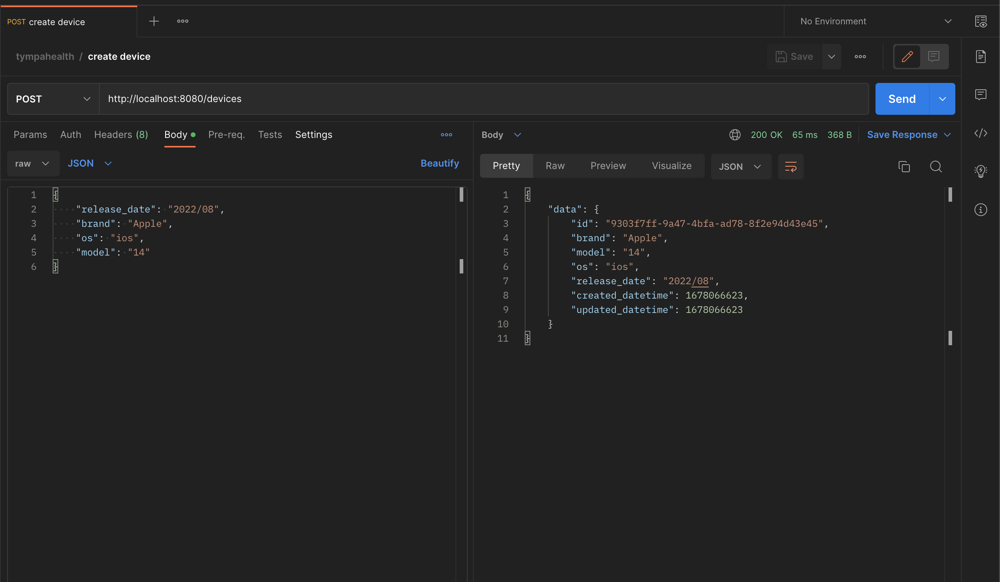

# Device Management (Technical Challenge, Tympahealth)

A service for managing devices. Built in PHP using the Slim Framework.

## Prerequisite

- Docker

## How to use

- In your terminal, run `docker compose up`
- Run this following query in the Postgres database to create the tables.

  ```sql
  CREATE TABLE devices (
      id varchar(255) unique,
      model varchar(255),
      brand varchar(255),
      release_date varchar(255) NULL,
      os varchar(255) NULL,
      created_datetime BIGINT NULL,
      updated_datetime BIGINT NULL
  );
  ```

- A [postman collection](https://github.com/iamuzor/tympahealth-exercise/blob/master/postman_collection.json) has been included. Enjoy 😊
  

## Todo

- API ✅
- Web UI ⏳

## Improvements (Not implemented)

- Data validation: To utilise an efficient library for handling request data validation. (Similar to how Laravel handles validation).
- Error handling: To introduce middleware that will catch errors and return the error in JSON format.
- Response Format: To introduce middleware for ensuring consistent data response format.
- Security: To introduce middleware to validate a predefined API Key.
- Tests: To add **more** API tests.
- Database migration: To use a migration library for handling database changes.
- Documentation: To add swagger API documentation.
